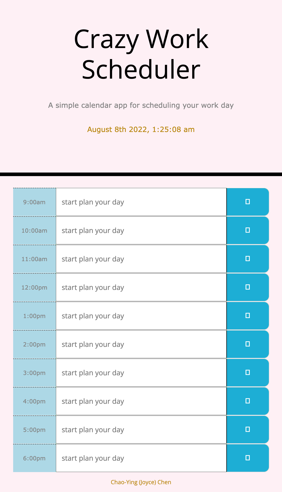

# Module 5 Challenge: Create a crazy-busy-scheduler

## Purpose: 
### Use current knowledge that we learned in class to apply in this assignment. Applying JavaScript add-on libray (Bootstrap, FontAwesome, jQuery, and moment.js) to make JavaScript more orgainzed and interactive.

---

## HTML: Code was provided as a starter code in the package. 

* Applied bootstrap spacing (my-5) to make currentday and time in the reasonable space in the Jumbotron area.
* Applied new class from Bootstrap library to make row-cloumns appreared the way how reference image was.
* Applied save icon from FontAwesome library to maske this crazy calender looks nicer. 
* Applied ID for each time in order to use this in JavaScript

## CSS: Code was provided as a starter code in the package. 

* Use this starter code to change colors as preferred
* Apply new class or ID in the CSS code

## JavaScript: Code was not provided.

* Use time fomate from moment.js library.
* Use jQuery click method syntax
* Use jQuery element selector syntax

---

## Deployed Image: 

---

## Required to submit the following URL for review:

* Github URL: 
https://github.com/Joyce750526/crazy-busy-scheduler

* Github Deployed Page: 
https://joyce750526.github.io/crazy-busy-scheduler/

---

Chao-Ying (Joyce) Chen
